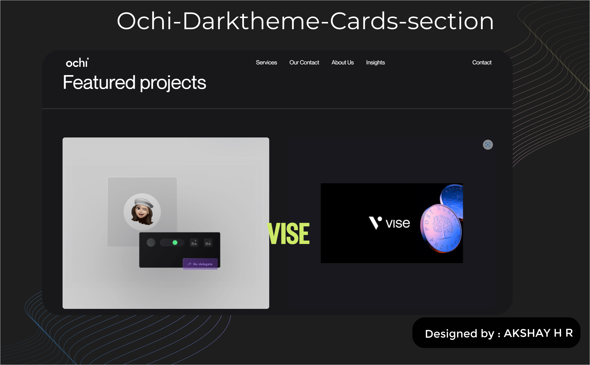

# OCHI Dark Theme
## 📷Snapshots :-

<p align="center">
  
</p>
<p align="center">
  
</p>
<p align="center">
  
</p>

## 🌑 Overview

The **OCHI Dark Theme** is a visually appealing dark-mode version of the OCHI website. It offers a modern, user-friendly interface that is optimized for low-light environments, providing a comfortable browsing experience for users who prefer dark themes.

## ✨ Features

- **Dark Themed UI**: Optimized for night-time browsing or users who prefer a dark user interface.
- **Responsive Design**: Fully responsive across all devices, ensuring the dark theme looks great on mobile, tablet, and desktop.
- **Modern Aesthetic**: Updated to reflect a sleek, minimalistic design.
  
## 🚀 Live Demo

Check out the live demo of the OCHI Dark Theme here: [Live Demo](https://ochi-dark-ui.netlify.app/)

## 🛠️ Installation

To run the OCHI Dark Theme locally on your machine, follow these steps:


1. **Clone the Repository**:

   ```bash
   git clone https://github.com/AKSHAYRAM2003/ochi-ui.git
   ```

2. **Navigate to the Project Directory**:

   ```bash
   cd ochi-ui
   ```

3. **Install Dependencies**:

   ```bash
   npm install
   ```

4. **Start the Development Server**:

   ```bash
   npm start
   ```

   The application will be available at `http://localhost:3000`.

## 🔨 Build

To create a production-ready build of the application:

```bash
npm run build
```

This will generate optimized static files in the `build` folder.

## 🤝 Contributing

Contributions are welcome! Please follow these steps if you'd like to contribute:

1. **Fork the repository**.
2. **Create a new branch**:

   ```bash
   git checkout -b feature/your-feature
   ```

3. **Commit your changes**:

   ```bash
   git commit -m 'Add feature: your feature description'
   ```

4. **Push to the branch**:

   ```bash
   git push origin feature/your-feature
   ```

5. **Submit a pull request** for review.


## 🏆 Acknowledgements

- **Original OCHI Light Theme**: [OCHI Light Theme](https://ochi.design/)

---

<p align="center">
  Designed by⛳ - AKSHAY H R
</p>


